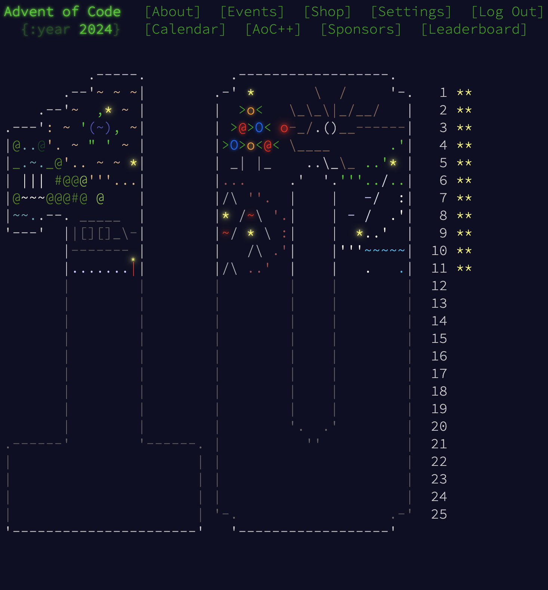

# 🎄Advent of Code 2024 – Java Solutions

## About the Project
Welcome to my personal solutions for [Advent of Code 2024](https://adventofcode.com/2024), written in **Java**!
Each day brings two new programming puzzle, and this repo tracks my progress through the challenges. It's a way for me to sharpen my problem-solving skills, deepen my understanding of Java, and have fun while doing it.

---



---

## Table of contents
- [Tech Stack](#tech-stack)
- [Structure](#structure)
- [Project setup](#project-setup)
- [Credits](#credits)
- [Licence](#licence)

## Tech Stack

- **Java 17+**
- IntelliJ
- Maven

---

## Structure

Each day's challenge is stored in its own directory under `/src/main/java` 


## Project Setup

Clone the repository in an IDE and run the code in your terminal:

```
git@github.com:AnneKluytmans/advent-of-code-2024.git    
``` 
or
```
git clone https://github.com/AnneKluytmans/advent-of-code-2024.git
```

## Credits
🎄 Thanks to Eric Wastl for creating Advent of Code

All puzzles and input data are created and owned by [Advent of Code](https://adventofcode.com) by Eric Wastl.

This repository contains **my personal solutions**, written for learning and fun. If you'd like to participate, please **join Advent of Code yourself** — it's free, and part of the fun is solving the puzzles with your own input!

## Licence
> "This project is not intended for commercial use."

> "Puzzle inputs included in this project are for reference only and should **not** be used to bypass the Advent of Code challenge experience."